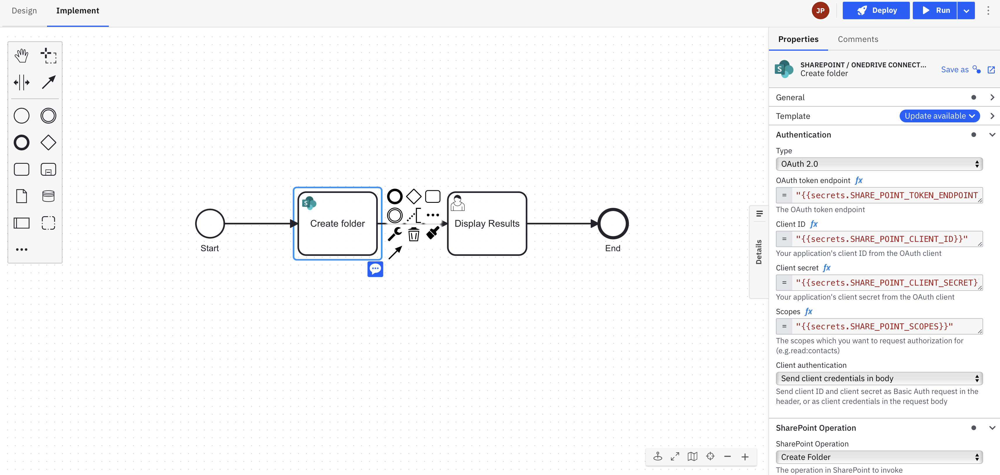

# Camunda Sharepoint / OneDrive Custom Connector Template
This project contains a custom Camunda 8 Connector template that provides access to SharePoint or OneDrive operations. 

# How to install the connector

## With Web Modeller
The following instructions detail how to install the conenctor template when using the Web Modeller, which can be used in a SaaS or Self-Managed environment: https://docs.camunda.io/docs/components/connectors/manage-connector-templates/#importing-existing-connector-templates

## Within Desktop Modeller
The following instructions detail how to install the conenctor template when using the Desktop Modeller, which can be used in a SaaS or Self-Managed environment:: https://docs.camunda.io/docs/components/modeler/desktop-modeler/element-templates/configuring-templates/

# How to use the Connector in a model?
First the Connector template needs to be uploaded to the project. Then, it can be used within a process model, for example:

# Supported Operations
Links below take you to the Microsoft documentation for the specific API
1. [Create Folder](https://learn.microsoft.com/en-us/graph/api/driveitem-post-children?view=graph-rest-1.0&tabs=http)
2. [List Children](https://learn.microsoft.com/en-us/graph/api/driveitem-list-children?view=graph-rest-1.0&tabs=http)
3. [CheckIn File](https://learn.microsoft.com/en-us/graph/api/driveitem-checkin?view=graph-rest-1.0&tabs=http)
4. [CheckOut File](https://learn.microsoft.com/en-us/graph/api/driveitem-checkout?view=graph-rest-1.0&tabs=http)
5. [Copy File](https://learn.microsoft.com/en-us/graph/api/driveitem-copy?view=graph-rest-1.0&tabs=http)
6. [Move File](https://learn.microsoft.com/en-us/graph/api/driveitem-move?view=graph-rest-1.0&tabs=http)
7. [Update File](https://learn.microsoft.com/en-us/graph/api/driveitem-update?view=graph-rest-1.0&tabs=http)
8. [Delete File](https://learn.microsoft.com/en-us/graph/api/driveitem-delete?view=graph-rest-1.0&tabs=http)
9. [Search](https://learn.microsoft.com/en-us/graph/api/driveitem-search?view=graph-rest-1.0&tabs=http)

# Prerequisites
1. App registration has been done on Azure with relevant roles.
2. You will need `Client Id`, `Client Secret`, `Tenant Id` for the app. These may be stored as secrets. 

# Element Template
The element template can be found in the `element-templates/sharepoint-onedrive-connector-template.json` file.

# Limitations
## The problem
There is a limitation in relation to uploading files. This is not unique to this Connector but rather related to the
way that _all_ BPM engines work in this regard. Specifically, uploading a file is typically a foreground operation - something
that the user needs to be involved with, i.e. selecting the file to upload. Conversely calling an integration - in this
case the Sharepoint Upload API - is typically a background operation located in a separate process activity altogether. 
This presents two fundamental problems for all BPM engines

1. What to do with the uploaded file between the point where the user uploads it in the foreground in one activity and the point (in another, background, activity) where it needs to be passed to the Upload API?
2. How does the background (system) activity that performs the actual upload impersonate the foreground user that requested the upload in the first place?

The only way, at the time of writing, to handle 1. above would be to hold an uploaded file (typically in `base64` format) as a process instance variable - and this is not recommended. 
Thus, without an approved way to deal with handling uploads at this time, we do not expose the Upload API. As/When Camunda do provide a solution
for this problem then the Connector can be extended to add the Upload API.

## The solution
If you do still require to upload files to Sharepoint then most likely you are simply thinking about this problem the wrong way.
Uploading files can be accomplished very effectively with a custom UI-component designed and written for the purpose.
Typically this comes in the form of a custom UI-control that is able to leverage the user's authentication to Sharepoint and based
on that interact directly with the Sharepoint API from the foreground - thereby overcoming boith the problems described above. 
Over the years BP3 has built similar UI-components many times and for many customers.

# Contributing
To contribute to this connector, see the [CONTRIBUTING](CONTRIBUTING.md) file.

# Licence
Any materials for this connector contributed by Camunda (e.g. JSON config file format) are covered by 
[Camunda's Documentation Licence](https://github.com/camunda/camunda-docs/blob/main/LICENSE.txt). 
Overall this Connector is covered by the [Creative Commons License](License) included in this repo.

